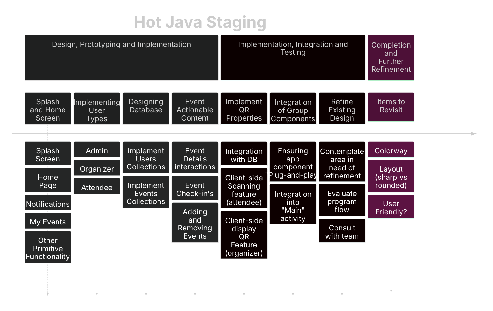
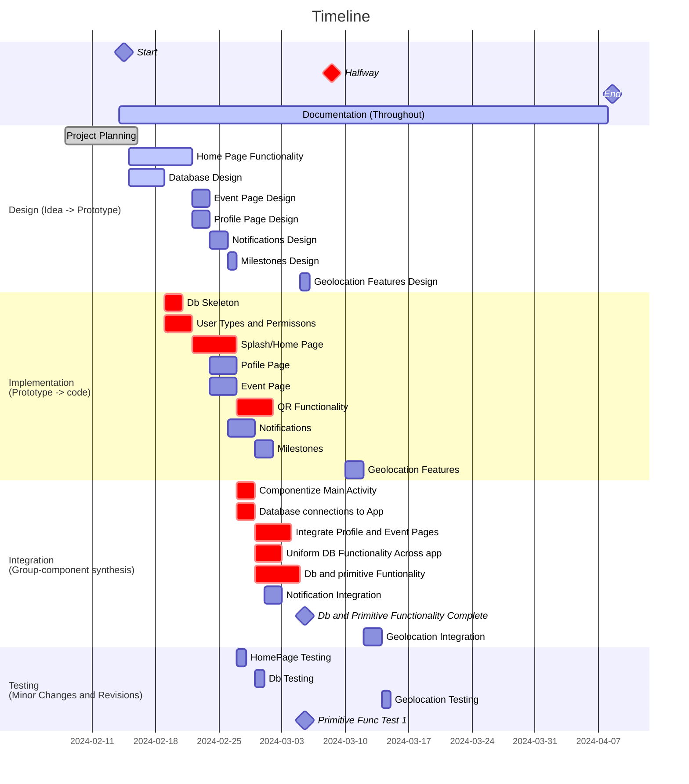
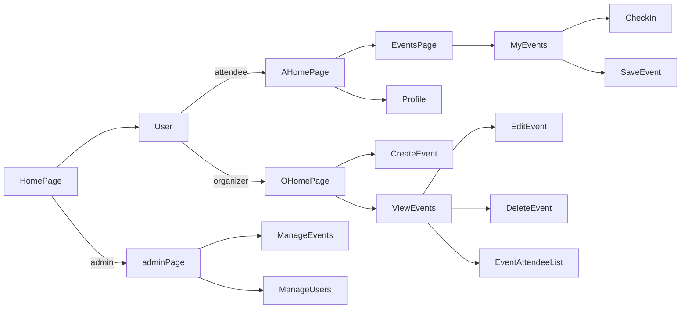

### Stages

### Gantt Timeline
Subject to change (add as necessary)
#### Topics
	Database
	Homepage/Splash
	User Permissions
	Events and Functionality
		QR functionality
	Notifications
		Milestones
	Primitive Functionality
	Additional Features
		Geolocation
	Frontend Layout (final)
		Colors, Shapes, Edges

###### Legend:
<ul>

 Critical

 Done 

 Inactive

 Active

</ul>

### High Level Program Flow
(To be updated as needed)

